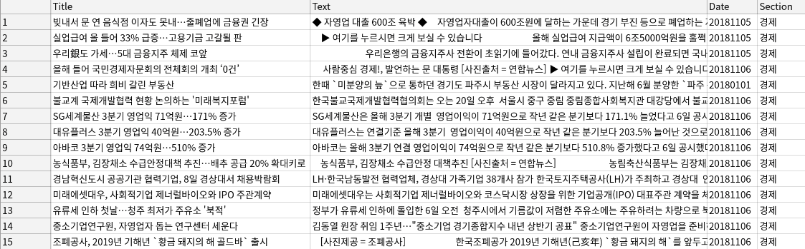
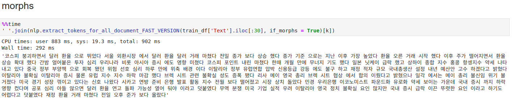
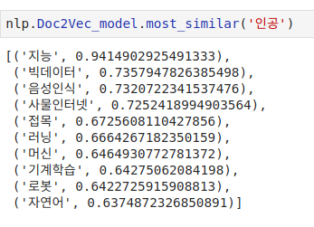

# Fininsight
> Research project with Fininsight Co.

 

# **뉴스 카테고리 분류**
> ### 9개 카테고리의 기사 classification
> ### [경제, 기업, 사회, 국제, 부동산, 증권, 정치, IT과학, 문화]
 

## Data Crawling (데이터 수집)

>#### **매일경제의 카테고리별로 기사를 수집**
- ko_crawler 모듈의 MKCrawler 클래스
   - MKCrawler.crawl_process
   - 병렬처리를 적용한 MKCrawler.crawl_process_FAST_VERSION을 사용하면 속도가 향상됩니다.

#### **수집 결과**
  

 
 

## **텍스트 전처리**

> **정규식을 사용하여 특수문자 제거 및 텍스트 클리닝 작업 수행**
> **어근 추출은 Konlpy의 Twitter 형태소 분석기 사용**

 
### kotext 모듈의 NLP 클래스
~~~  
NLP.extract_morphs_for_all_document : 텍스트 클리닝 및 morph 추출
NLP.extract_nouns_for_all_document : 텍스트 클리닝 및 명사 추출
NLP.extract_tokens_for_all_document_FAST_VERSION : 멀티스레드 적용, 속도 향상
~~~

### **전처리 전**

### **전처리 후**

 
 
 

## **Doc2Vec**

> **문서별로 토큰을 추출한 후, gensim의 Doc2Vec으로 학습시킨다.**
> **tag는 각 기사의 카테고리로 unique하게 학습**
~~~  
NLP.make_Doc2Vec_model : Doc2Vec 모델 생성
NLP.build_and_train_Doc2Vec_model : build & train 작업 동시에 수행
~~~

+ #### **학습 결과**
 

### **파라미터 튜닝**
> Doc2Vec 파라미터 튜닝을 위해, default Logistic Regression을 사용

 + #### **결과**
   - 문서 수 : 약 10,000개
   

   - 문서 수 : 약 88,000
