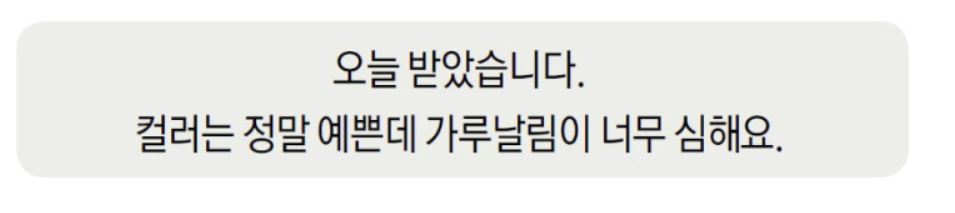

# **감성분석**

> ### **텍스트에 드러나는 주관적인 요소(sentiment, opinion)을 판별하여 이를 수치화하는 작업**
 - 자료 출처: 동아비지니스 리뷰 (이화여대 신경식 교수님) http://dbr.donga.com/article/view/1202/article_no/8891

.

# **Why 감성분석?**
> #### SNS, 페이스북, 트위터에서 실시간으로 수 많은 정보가 쏟아지고 있음.

>소비자의 욕구를 정확히 파악하기 위해서 어떤 자료가 더 도움이 될까?
>
>별점 vs **리뷰**
>
>더 많은 정보를 담고 있는건 **텍스트 데이터**

.

## **성공 사례**
 - **"배고플 때 넌 네가 아니야!"**
> 매일 약 14,000개 이상의 소셜미디어에 포스팅 되는 글을 실시간으로 수집
> 수집한 글과 미리 제작한 감성사전의 긍정 & 부정 어휘를 매칭하여, 사람들의 실시간 감정 상태를 확인
> 불만 지수가 높을수록 할인폭 증가 : \$1.75 ->  \$ 0.5
> 실시간으로 가격에 반영하여, 가격 등락

.

# **How 감성분석?**

## **1. 사전 기반 감성분석**

> #### 리뷰에서 나오는 속성/감성어와 대응하는 단어를 미리 구축해둔 감성사전에 매칭시켜 감성 점수를 계산하는 방식!

+ ### **장점**
> 도메인에 적합한 감성사전을 구축하면, 속성 별로 구분된 구체적인 감성점수를 추출 가능

> domain-specific 감성사전을 사용하면 general 감성사전을 사용하는 것보다 성능이 향상된다는 것이 대부분의 paper에서 나온 결론 (ex: 잘 터진다 : wifi에서는 긍정))

+ ### **단점**
> **감성사전 구축에 많은 시간과 비용이 소모**
> 감성사전에 없는 단어나 새롭게 등장하는 신조어들은 감성점수 산출 과정에 반영하지 못함

.

## **2. 학습 기반 감성분석**

> #### 별점, 평점과 같이 긍부정을 분류할 수 있는 label이 있는 데이터에 적용 가능   
> 별점, 평점을 기반으로 긍부정을 분류하고 (ex 3.5점 이상 긍정)
> 해당 리뷰를 벡터화(TF-IDF, embedding)시켜 리뷰 벡터와 긍부정 레이블을 학습시키는 방식

.

+ ### **장점**
> 감성 사전을 구축하는 것에 비해 시간과 비용이 적게 소모됨
> 다양한 분류 알고리즘을 적용할 수 있다.
> 최근 논문들을 살펴보면 embedding + 딥러닝(CNN)의 조합이 좋은 성과를 보이고 있다고 함.

+ ### **단점**
> 뉴스와 같이, 별점이 없는 데이터는 학습시킬 레이블이 없어 분류가 불가능
> 주로 제품 리뷰와 같은 특정 도메인에만 적용 가능

.

# **추가 자료**
## **단어 간 cosine similarity를 기반으로 감성사전을 구축한 논문**

### **장점**
> 감성 사전을 구축하는데 필요한 시간과 비용이 크게 감소
> 명확한 극성을 가진 단어(ex: 좋다)를 기반으로 감성사전이 구축되기 때문에, 신조어, 축약어 들도 감성사전에 업데이트됨

### **단점**
> 동의어 뿐만 아니라 반의어까지 같은 극성을 갖는 경우도 발생
> (ex: 좋다와 싫다가 같이 등장하면, 둘은 비슷한 극성으로 분류)
